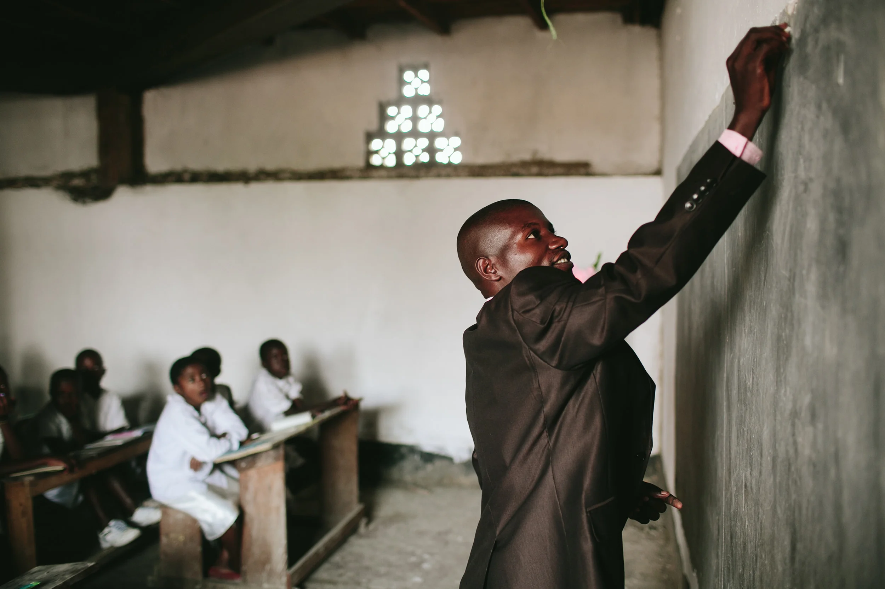

# Schoolyear – Open Problem Statement

## The Problem  
- Millions of children in low-income countries are unable to attend school because their families cannot pay the annual fees.  
- In many of these countries, schools, teachers, and government-recognised institutions *already exist*. One of the main bottlenecks is **tuition costs**.  
- Existing NGOs and charities often:  
  - Spend heavily on overhead, marketing, or “feel-good” activities.  
  - Lack transparency (donors don’t see where their money goes).  
  - Don’t scale, because they try to build new infrastructure instead of plugging into existing systems.

## Schoolyear Approach
- Treat education as a **unit of distribution**, for example:  
- **€200 = 1 school year.**  
- **Verifiable impact** → for every unit funded, we provide anonymised copies of official enrollment/completion certificates.  
- **No feel-good charity** → just clean infrastructure that channels resources into existing schools.  

## Advantages  
- **Scalable** → the model can run anywhere there are schools + fees.  
- **Transparent** → donors see proof of exactly what they funded.  
- **Efficient** → almost all funds go directly to the solution.  

## What Schoolyear is *Not*

1. **Not addressing the quality of education**  
   - Schoolyear does not intervene in teacher training, curriculum design, or classroom pedagogy.  
   - Many organisations already work on improving quality; the role of Schoolyear is to ensure that more children can access school in the first place.  

2. **Not preferring one demographic segment over another**  
   - Schoolyear is not designed to prioritise boys over girls, or vice versa.  
   - Every child’s school year is treated as the same €200 unit in the model, and funding is provided on equal terms.  
   - Partner organisations may choose to emphasise particular groups, but the underlying infrastructure remains neutral.  

3. **Not building or managing physical infrastructure**  
   - Schoolyear does not construct schools, hire teachers, or run logistics.  
   - The system plugs into government-recognised institutions that already exist.  
   - The value lies in removing the financial bottleneck of school fees, not duplicating infrastructure.  

### Why these boundaries matter

- **Clarity** → Donors, funders, and partners know exactly what their contribution does: *€200 = one year of school*.  
- **Scalability** → Neutrality and simplicity make the system easy to replicate in multiple contexts without becoming entangled in policy debates.  
- **Respect of local decision making** → NGOs, charities, and humanitarian organisations often implicitly push their own agendas — prioritising certain groups, imposing outside values, or tying funding to conditions. Schoolyear avoids this by remaining neutral and simply paying recognised school fees. Local institutions decide how to run their schools; the system only removes the financial barrier that prevents children from attending.

> Schoolyear is a **distribution mechanism**: it channels funds directly into school years, with proof.